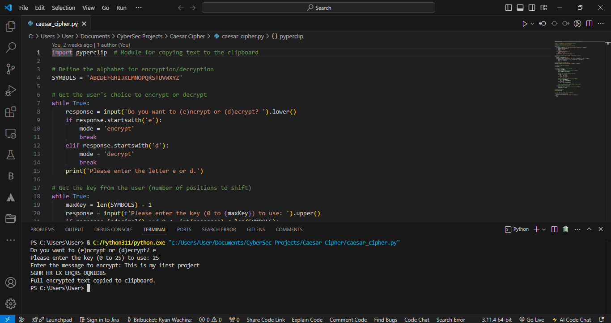
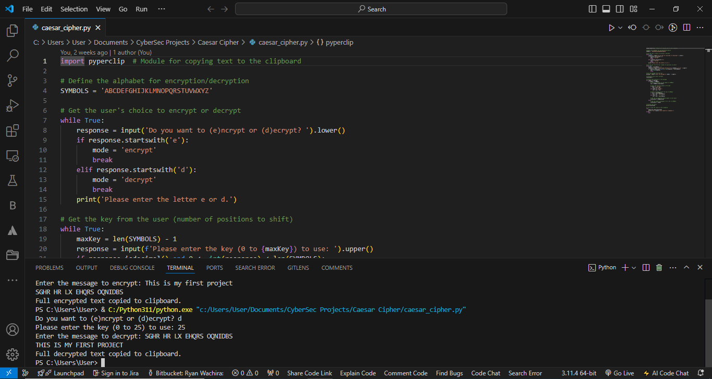

# Caesar Cipher in Python

This project is a Python implementation of the Caesar Cipher, a simple encryption technique that shifts the letters of a message by a fixed number of positions in the alphabet.

## Features
- **Encrypt and Decrypt Messages:** Users can choose to encrypt or decrypt a message by selecting a shift key.
- **Customizable Shift Key:** The program allows users to specify a key, which determines the number of positions each letter is shifted.
- **Error Handling:** The program includes basic error handling for user inputs.
- **Clipboard Integration:** The encrypted or decrypted message can be automatically copied to the clipboard using the `pyperclip` library.

## How It Works
The Caesar Cipher shifts each letter in the message by the number of positions specified by the user. The program only processes uppercase alphabetic characters, leaving other characters unchanged.

### Encryption Example

```
Do you want to (e)ncrypt or (d)ecrypt? e
Please enter the key (0 to 25) to use: 25
Enter the message to encrypt: This is my first project
SGHR HR LX EHQRS OQNIDBS
```



### Decryption Example

```
Do you want to (e)ncrypt or (d)ecrypt? d
Please enter the key (0 to 25) to use: 25
Enter the message to decrypt: SGHR HR LX EHQRS OQNIDBS
THIS IS MY FIRST PROJECT
```



## Requirements
- Python 3.x
- Optional: `pyperclip` module (for copying text to the clipboard)

To install `pyperclip`, run:
```bash
pip install pyperclip
